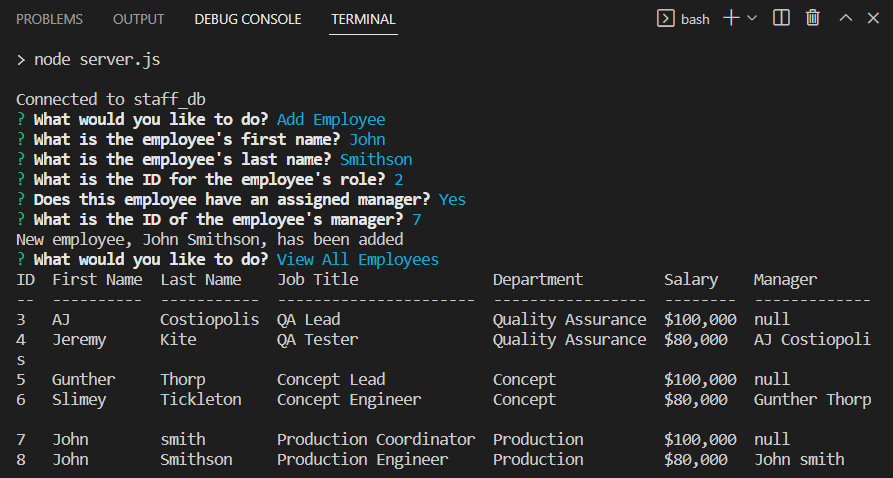

# Employee Tracker

## Description

This program runs entirely in the command line and connects to a SQL database, allowing you to view, edit, and otherwise manage a staff database containing IDs, names, departments, and more. 

## Table of Contents

- [Installation](#installation)
- [Usage](#usage)
- [Credits](#credits)
- [Contribution](#contribution)
- [Questions](#questions)

## Installation

- After navigating to the program folder in the command line, type ```npm install``` into the command line, then press Enter to install all necessary dependencies.
- Replace the values in ```const connection``` found on line 20 of ```server.js``` with your own MySQL connection information.
- After navigating to the ```db``` folder in the command line, type ```mysql -u root -p < schema.sql``` into the command line, then press Enter to set up the default database.
- (Optional) After navigating to the ```db``` folder in the command line, type ```mysql -u root -p < seeds.sql``` into the command line, then press Enter to seed the database with some premade data.

## Usage

1. Navigate to the program folder in the command line.
2. Type ```npm start``` into the command line, then press Enter.
3. Use your keyboard to make selections, follow prompts, and add information as needed.
4. When you're finished, use ```Ctrl + C``` to exit the program.
    
<br>

- A video of the program in use, with all of its components, can be found [here](https://drive.google.com/file/d/127CYnbm9bigXXQnPpzc3r625JFR-x-qr/view?usp=sharing)

## Credits
Built in part using [Inquirer.js](https://www.npmjs.com/package/inquirer/v/8.2.4)
<br>Built in part using [console.table](https://www.npmjs.com/package/console.table)
<br>Built in part using [MySQL2](https://www.npmjs.com/package/mysql2)

## Contribution

Currently, this is a solo developer project.

## Questions

Any questions about this software can be directed to the author via
Github: https://github.com/joshmusto